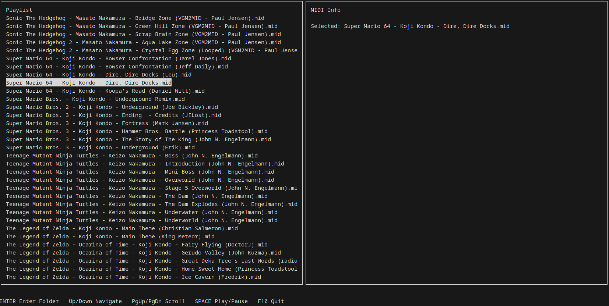

# midic (v5)

Simple ncurses MIDI browser/player (personal project). Included are a couple of changes made my copilot.

## Description
midic is a tiny terminal MIDI browser/player. It lists directories first (alphabetical), then `.mid` files (alphabetical). Use it to navigate folders and play MIDI files via `aplaymidi`.

Controls:
- Up / Down: move selection
- Enter: enter directory or play file
- Space: play selected file
- PgUp / PgDn: jump pages
- F10: quit

## Dependencies

Build-time:
- gcc (or other C compiler)
- libncurses development headers

Run-time:
- aplaymidi (from the alsa-utils package) — used to play MIDI files via ALSA

On Arch Linux:
```
sudo pacman -S base-devel ncurses alsa-utils
```

## Build

Compile with:
```
gcc midic.c -lncurses -o midic
```

## Run

Start in the current directory (or pass a start-directory):
```
./midic
./midic /path/to/midi/folder
```

To test your MIDI playback outside midic:
```
aplaymidi somefile.mid
```
If `aplaymidi` cannot find a MIDI port, consult ALSA documentation for connecting to a hardware or software synthesizer.


## Screenshot

<p float="left">
  
</p>

## Notes
- This program uses `system("aplaymidi ...")` to play files; it stops other `aplaymidi` processes before starting a new one.
- Designed as a small personal project; use at your own risk.

```
